```python
import numpy as np
```

Here we have read the text file and as per mentioned in the file "zoo.name", each line contains name of the animal along with its 16 feature vectors with its label at the end. We have extracted in the animal names into animal_name list and then features and labels into data list


```python
animal_name = []
data = []
with open("zoo.data", "r") as f:
    for line in f.readlines():
        line = line.strip().split(",")
        animal_name.append(line[0])
        code = [i for i in map(int, line[1:])]
        data.append(code)
```


```python
data = np.array(data)
```


```python
data.shape
```


    (101, 17)


Here we have splitted the features and labels into x_data and y_data


```python
x_data = data[:,:-1]
y_data = data[:,-1]
```


```python
x_data.shape, y_data.shape
```


    ((101, 16), (101,))


Saving the numpy x_data and y_data arrays


```python
np.save("x.npy",x_data)
np.save("y.npy", y_data)
```


Here we have suppressed warnings that were flooding the output, making it harder for a better visualisation.


```python
import warnings
from sklearn.exceptions import UndefinedMetricWarning
warnings.filterwarnings(action='ignore', category=UndefinedMetricWarning)
```


```python
import numpy as np
```


```python
x_data = np.load("x.npy")
y_data = np.load("y.npy")
```


```python
x_data.shape
```


    (101, 16)


When splitting the dataset into train and test, it should be kept in mind that instance of every class must be present in both the sets atleast once. For the same, we have used StratifiedShuffleSplit to accomplish splitting the dataset into stratifically shuffled manner.


```python
from sklearn.model_selection import StratifiedShuffleSplit
```

Here the test set size is taken as 20% as the whole dataset was of size 101, where there was animal "frog" twice and "girl" once, reducing the size to 99.


```python
sss = StratifiedShuffleSplit(test_size=0.2)
```


```python
for train_index, test_index in sss.split(x_data, y_data):
    x_train, x_test = x_data[train_index], x_data[test_index]
    y_train, y_test = y_data[train_index], y_data[test_index]
```


```python
x_train.shape, x_test.shape
```


    ((80, 16), (21, 16))


```python
np.unique(y_train, return_counts=True)
```


    (array([1, 2, 3, 4, 5, 6, 7]), array([33, 16,  4, 10,  3,  6,  8]))


```python
from sklearn.svm import SVC
```

Here classifiers is a list of Support Vector Classifiers with different kernels. The parameter "probability=True" is for calculating negative log loss of the model, i.e toggling predict_proba method. For kernel coefficient for 'rbf', 'poly' and 'sigmoid', gamma is set to 'auto' which uses 1 / n_features. (n_features = 16)


```python
classifiers = [SVC(kernel="linear", probability=True), SVC(kernel="rbf", probability=True, gamma="auto"), SVC(kernel="poly", probability=True, gamma="auto"), SVC(kernel="sigmoid", probability=True, gamma="auto")]
```


```python
from sklearn.metrics import classification_report
from sklearn.model_selection import cross_validate
```


```python
from sklearn.metrics import make_scorer, accuracy_score
```


```python
def scorer(y, y_pred):
    print(classification_report(y, y_pred))
    return accuracy_score(y, y_pred)
```

Here for the k fold cross-validation we have used k=4 as the least popular class has total number of instances 4. So a cross validation of k = 5 is not possible. We have done k = 4, along with taking the entire dataset for the purpose such that k = 4 is atleast possible.


```python
def evaluate(model, x, y, cv=4):
    print("K:", cv)
    print("Kernel:", model.kernel.upper())
    result = cross_validate(model, x, y, cv=cv, scoring=make_scorer(scorer), return_train_score=True)
    print("Tests score:", result["test_score"])
    print("Train score:", result["train_score"])
```

Here, We have echoed the full classification table where we can obtain the precision, recall and f1-score of every model trained during the cross-validation. First the testing report is printed for each model then the training report, at last for each kernel, an accuracy metric is also echoed for each of the model.


```python
for classifier in classifiers:
    evaluate(classifier, x_data, y_data)
    print("\n\n\n")
```

    K: 4
    Kernel: LINEAR
                  precision    recall  f1-score   support
    
               1       1.00      1.00      1.00        11
               2       1.00      1.00      1.00         5
               3       1.00      0.50      0.67         2
               4       0.80      1.00      0.89         4
               5       1.00      1.00      1.00         1
               6       1.00      1.00      1.00         2
               7       1.00      1.00      1.00         3
    
       micro avg       0.96      0.96      0.96        28
       macro avg       0.97      0.93      0.94        28
    weighted avg       0.97      0.96      0.96        28
    
                  precision    recall  f1-score   support
    
               1       1.00      1.00      1.00        30
               2       1.00      1.00      1.00        15
               3       1.00      1.00      1.00         3
               4       1.00      1.00      1.00         9
               5       1.00      1.00      1.00         3
               6       1.00      1.00      1.00         6
               7       1.00      1.00      1.00         7
    
       micro avg       1.00      1.00      1.00        73
       macro avg       1.00      1.00      1.00        73
    weighted avg       1.00      1.00      1.00        73
    
                  precision    recall  f1-score   support
    
               1       1.00      1.00      1.00        10
               2       1.00      1.00      1.00         5
               3       1.00      1.00      1.00         1
               4       1.00      1.00      1.00         3
               5       1.00      1.00      1.00         1
               6       0.67      1.00      0.80         2
               7       1.00      0.67      0.80         3
    
       micro avg       0.96      0.96      0.96        25
       macro avg       0.95      0.95      0.94        25
    weighted avg       0.97      0.96      0.96        25
    
                  precision    recall  f1-score   support
    
               1       1.00      1.00      1.00        31
               2       1.00      1.00      1.00        15
               3       1.00      1.00      1.00         4
               4       1.00      1.00      1.00        10
               5       1.00      1.00      1.00         3
               6       1.00      1.00      1.00         6
               7       1.00      1.00      1.00         7
    
       micro avg       1.00      1.00      1.00        76
       macro avg       1.00      1.00      1.00        76
    weighted avg       1.00      1.00      1.00        76
    
                  precision    recall  f1-score   support
    
               1       1.00      1.00      1.00        10
               2       0.83      1.00      0.91         5
               3       0.00      0.00      0.00         1
               4       1.00      1.00      1.00         3
               5       0.00      0.00      0.00         1
               6       1.00      1.00      1.00         2
               7       1.00      1.00      1.00         2
    
       micro avg       0.92      0.92      0.92        24
       macro avg       0.69      0.71      0.70        24
    weighted avg       0.88      0.92      0.90        24
    
                  precision    recall  f1-score   support
    
               1       1.00      1.00      1.00        31
               2       1.00      1.00      1.00        15
               3       1.00      1.00      1.00         4
               4       1.00      1.00      1.00        10
               5       1.00      1.00      1.00         3
               6       1.00      1.00      1.00         6
               7       1.00      1.00      1.00         8
    
       micro avg       1.00      1.00      1.00        77
       macro avg       1.00      1.00      1.00        77
    weighted avg       1.00      1.00      1.00        77
    
                  precision    recall  f1-score   support
    
               1       1.00      1.00      1.00        10
               2       1.00      1.00      1.00         5
               3       0.00      0.00      0.00         1
               4       1.00      1.00      1.00         3
               5       0.50      1.00      0.67         1
               6       1.00      1.00      1.00         2
               7       1.00      1.00      1.00         2
    
       micro avg       0.96      0.96      0.96        24
       macro avg       0.79      0.86      0.81        24
    weighted avg       0.94      0.96      0.94        24
    
                  precision    recall  f1-score   support
    
               1       1.00      1.00      1.00        31
               2       1.00      1.00      1.00        15
               3       1.00      1.00      1.00         4
               4       1.00      1.00      1.00        10
               5       1.00      1.00      1.00         3
               6       1.00      1.00      1.00         6
               7       1.00      1.00      1.00         8
    
       micro avg       1.00      1.00      1.00        77
       macro avg       1.00      1.00      1.00        77
    weighted avg       1.00      1.00      1.00        77
    
    Tests score: [ 0.96428571  0.96        0.91666667  0.95833333]
    Train score: [ 1.  1.  1.  1.]
    
    
    
    
    K: 4
    Kernel: RBF
                  precision    recall  f1-score   support
    
               1       1.00      1.00      1.00        11
               2       1.00      1.00      1.00         5
               3       0.00      0.00      0.00         2
               4       0.67      1.00      0.80         4
               5       1.00      1.00      1.00         1
               6       1.00      1.00      1.00         2
               7       1.00      1.00      1.00         3
    
       micro avg       0.93      0.93      0.93        28
       macro avg       0.81      0.86      0.83        28
    weighted avg       0.88      0.93      0.90        28
    
                  precision    recall  f1-score   support
    
               1       0.91      1.00      0.95        30
               2       1.00      1.00      1.00        15
               3       0.00      0.00      0.00         3
               4       0.90      1.00      0.95         9
               5       1.00      0.67      0.80         3
               6       1.00      1.00      1.00         6
               7       1.00      1.00      1.00         7
    
       micro avg       0.95      0.95      0.95        73
       macro avg       0.83      0.81      0.81        73
    weighted avg       0.91      0.95      0.92        73
    
                  precision    recall  f1-score   support
    
               1       1.00      1.00      1.00        10
               2       1.00      1.00      1.00         5
               3       0.00      0.00      0.00         1
               4       0.75      1.00      0.86         3
               5       1.00      1.00      1.00         1
               6       0.50      1.00      0.67         2
               7       1.00      0.33      0.50         3
    
       micro avg       0.88      0.88      0.88        25
       macro avg       0.75      0.76      0.72        25
    weighted avg       0.89      0.88      0.86        25
    
                  precision    recall  f1-score   support
    
               1       0.91      1.00      0.95        31
               2       1.00      1.00      1.00        15
               3       0.00      0.00      0.00         4
               4       0.83      1.00      0.91        10
               5       1.00      0.67      0.80         3
               6       1.00      1.00      1.00         6
               7       1.00      1.00      1.00         7
    
       micro avg       0.93      0.93      0.93        76
       macro avg       0.82      0.81      0.81        76
    weighted avg       0.89      0.93      0.91        76
    
                  precision    recall  f1-score   support
    
               1       0.91      1.00      0.95        10
               2       1.00      1.00      1.00         5
               3       0.00      0.00      0.00         1
               4       1.00      1.00      1.00         3
               5       1.00      1.00      1.00         1
               6       1.00      1.00      1.00         2
               7       1.00      0.50      0.67         2
    
       micro avg       0.92      0.92      0.92        24
       macro avg       0.84      0.79      0.80        24
    weighted avg       0.92      0.92      0.91        24
    
                  precision    recall  f1-score   support
    
               1       0.97      1.00      0.98        31
               2       1.00      1.00      1.00        15
               3       1.00      0.25      0.40         4
               4       0.83      1.00      0.91        10
               5       1.00      1.00      1.00         3
               6       1.00      1.00      1.00         6
               7       1.00      1.00      1.00         8
    
       micro avg       0.96      0.96      0.96        77
       macro avg       0.97      0.89      0.90        77
    weighted avg       0.97      0.96      0.95        77
    
                  precision    recall  f1-score   support
    
               1       0.83      1.00      0.91        10
               2       1.00      1.00      1.00         5
               3       0.00      0.00      0.00         1
               4       1.00      1.00      1.00         3
               5       0.00      0.00      0.00         1
               6       1.00      1.00      1.00         2
               7       1.00      1.00      1.00         2
    
       micro avg       0.92      0.92      0.92        24
       macro avg       0.69      0.71      0.70        24
    weighted avg       0.85      0.92      0.88        24
    
                  precision    recall  f1-score   support
    
               1       0.94      1.00      0.97        31
               2       1.00      1.00      1.00        15
               3       1.00      0.25      0.40         4
               4       0.83      1.00      0.91        10
               5       1.00      0.67      0.80         3
               6       1.00      1.00      1.00         6
               7       1.00      1.00      1.00         8
    
       micro avg       0.95      0.95      0.95        77
       macro avg       0.97      0.85      0.87        77
    weighted avg       0.95      0.95      0.94        77
    
    Tests score: [ 0.92857143  0.88        0.91666667  0.91666667]
    Train score: [ 0.94520548  0.93421053  0.96103896  0.94805195]
    
    
    
    
    K: 4
    Kernel: POLY
                  precision    recall  f1-score   support
    
               1       1.00      0.91      0.95        11
               2       1.00      1.00      1.00         5
               3       0.00      0.00      0.00         2
               4       0.50      1.00      0.67         4
               5       1.00      1.00      1.00         1
               6       1.00      1.00      1.00         2
               7       1.00      0.67      0.80         3
    
       micro avg       0.86      0.86      0.86        28
       macro avg       0.79      0.80      0.77        28
    weighted avg       0.86      0.86      0.84        28
    
                  precision    recall  f1-score   support
    
               1       1.00      0.93      0.97        30
               2       1.00      1.00      1.00        15
               3       1.00      0.67      0.80         3
               4       0.60      1.00      0.75         9
               5       1.00      1.00      1.00         3
               6       1.00      1.00      1.00         6
               7       1.00      0.57      0.73         7
    
       micro avg       0.92      0.92      0.92        73
       macro avg       0.94      0.88      0.89        73
    weighted avg       0.95      0.92      0.92        73
    
                  precision    recall  f1-score   support
    
               1       1.00      1.00      1.00        10
               2       1.00      1.00      1.00         5
               3       0.00      0.00      0.00         1
               4       0.75      1.00      0.86         3
               5       1.00      1.00      1.00         1
               6       0.50      1.00      0.67         2
               7       1.00      0.33      0.50         3
    
       micro avg       0.88      0.88      0.88        25
       macro avg       0.75      0.76      0.72        25
    weighted avg       0.89      0.88      0.86        25
    
                  precision    recall  f1-score   support
    
               1       1.00      0.90      0.95        31
               2       1.00      1.00      1.00        15
               3       1.00      0.50      0.67         4
               4       0.53      1.00      0.69        10
               5       1.00      1.00      1.00         3
               6       1.00      1.00      1.00         6
               7       1.00      0.43      0.60         7
    
       micro avg       0.88      0.88      0.88        76
       macro avg       0.93      0.83      0.84        76
    weighted avg       0.94      0.88      0.88        76
    
                  precision    recall  f1-score   support
    
               1       0.90      0.90      0.90        10
               2       1.00      1.00      1.00         5
               3       0.00      0.00      0.00         1
               4       0.50      1.00      0.67         3
               5       1.00      1.00      1.00         1
               6       1.00      1.00      1.00         2
               7       0.00      0.00      0.00         2
    
       micro avg       0.83      0.83      0.83        24
       macro avg       0.63      0.70      0.65        24
    weighted avg       0.77      0.83      0.79        24
    
                  precision    recall  f1-score   support
    
               1       1.00      0.94      0.97        31
               2       1.00      1.00      1.00        15
               3       0.00      0.00      0.00         4
               4       0.59      1.00      0.74        10
               5       0.75      1.00      0.86         3
               6       1.00      1.00      1.00         6
               7       1.00      0.75      0.86         8
    
       micro avg       0.90      0.90      0.90        77
       macro avg       0.76      0.81      0.77        77
    weighted avg       0.88      0.90      0.88        77
    
                  precision    recall  f1-score   support
    
               1       1.00      0.80      0.89        10
               2       1.00      1.00      1.00         5
               3       0.00      0.00      0.00         1
               4       0.50      1.00      0.67         3
               5       0.50      1.00      0.67         1
               6       1.00      1.00      1.00         2
               7       1.00      0.50      0.67         2
    
       micro avg       0.83      0.83      0.83        24
       macro avg       0.71      0.76      0.70        24
    weighted avg       0.88      0.83      0.83        24
    
                  precision    recall  f1-score   support
    
               1       1.00      0.90      0.95        31
               2       0.94      1.00      0.97        15
               3       0.00      0.00      0.00         4
               4       0.53      1.00      0.69        10
               5       1.00      1.00      1.00         3
               6       1.00      1.00      1.00         6
               7       1.00      0.62      0.77         8
    
       micro avg       0.87      0.87      0.87        77
       macro avg       0.78      0.79      0.77        77
    weighted avg       0.87      0.87      0.86        77
    
    Tests score: [ 0.85714286  0.88        0.83333333  0.83333333]
    Train score: [ 0.91780822  0.88157895  0.8961039   0.87012987]
    
    
    
    
    K: 4
    Kernel: SIGMOID
                  precision    recall  f1-score   support
    
               1       0.71      0.91      0.80        11
               2       0.71      1.00      0.83         5
               3       0.00      0.00      0.00         2
               4       0.57      1.00      0.73         4
               5       0.00      0.00      0.00         1
               6       0.00      0.00      0.00         2
               7       0.00      0.00      0.00         3
    
       micro avg       0.68      0.68      0.68        28
       macro avg       0.29      0.42      0.34        28
    weighted avg       0.49      0.68      0.57        28
    
                  precision    recall  f1-score   support
    
               1       0.78      0.97      0.87        30
               2       0.62      1.00      0.77        15
               3       0.00      0.00      0.00         3
               4       0.75      1.00      0.86         9
               5       0.00      0.00      0.00         3
               6       0.00      0.00      0.00         6
               7       0.00      0.00      0.00         7
    
       micro avg       0.73      0.73      0.73        73
       macro avg       0.31      0.42      0.36        73
    weighted avg       0.54      0.73      0.62        73
    
                  precision    recall  f1-score   support
    
               1       0.91      1.00      0.95        10
               2       0.50      1.00      0.67         5
               3       0.00      0.00      0.00         1
               4       0.75      1.00      0.86         3
               5       0.00      0.00      0.00         1
               6       0.00      0.00      0.00         2
               7       0.00      0.00      0.00         3
    
       micro avg       0.72      0.72      0.72        25
       macro avg       0.31      0.43      0.35        25
    weighted avg       0.55      0.72      0.62        25
    
                  precision    recall  f1-score   support
    
               1       0.81      0.94      0.87        31
               2       0.68      1.00      0.81        15
               3       0.00      0.00      0.00         4
               4       0.71      1.00      0.83        10
               5       0.00      0.00      0.00         3
               6       0.00      0.00      0.00         6
               7       1.00      0.57      0.73         7
    
       micro avg       0.76      0.76      0.76        76
       macro avg       0.46      0.50      0.46        76
    weighted avg       0.65      0.76      0.69        76
    
                  precision    recall  f1-score   support
    
               1       0.82      0.90      0.86        10
               2       0.62      1.00      0.77         5
               3       0.00      0.00      0.00         1
               4       0.60      1.00      0.75         3
               5       0.00      0.00      0.00         1
               6       0.00      0.00      0.00         2
               7       0.00      0.00      0.00         2
    
       micro avg       0.71      0.71      0.71        24
       macro avg       0.29      0.41      0.34        24
    weighted avg       0.55      0.71      0.61        24
    
                  precision    recall  f1-score   support
    
               1       0.77      0.97      0.86        31
               2       0.68      1.00      0.81        15
               3       0.00      0.00      0.00         4
               4       0.67      1.00      0.80        10
               5       0.00      0.00      0.00         3
               6       0.00      0.00      0.00         6
               7       1.00      0.12      0.22         8
    
       micro avg       0.73      0.73      0.73        77
       macro avg       0.45      0.44      0.38        77
    weighted avg       0.63      0.73      0.63        77
    
                  precision    recall  f1-score   support
    
               1       0.77      1.00      0.87        10
               2       0.62      1.00      0.77         5
               3       0.00      0.00      0.00         1
               4       1.00      1.00      1.00         3
               5       0.00      0.00      0.00         1
               6       0.00      0.00      0.00         2
               7       0.00      0.00      0.00         2
    
       micro avg       0.75      0.75      0.75        24
       macro avg       0.34      0.43      0.38        24
    weighted avg       0.58      0.75      0.65        24
    
                  precision    recall  f1-score   support
    
               1       0.88      0.94      0.91        31
               2       0.54      1.00      0.70        15
               3       0.00      0.00      0.00         4
               4       0.67      1.00      0.80        10
               5       0.00      0.00      0.00         3
               6       0.00      0.00      0.00         6
               7       1.00      0.12      0.22         8
    
       micro avg       0.71      0.71      0.71        77
       macro avg       0.44      0.44      0.38        77
    weighted avg       0.65      0.71      0.63        77
    
    Tests score: [ 0.67857143  0.72        0.70833333  0.75      ]
    Train score: [ 0.7260274   0.76315789  0.72727273  0.71428571]
    
    
    
    


### Conclusion

Looking into the cross-validation classification report of these SVCs we can deduce that, **Linear** kernels are the best performing at default settings followed by **RBF** then **POLYNOMIAL** and **SIGMOID** kernels in that order.


## SVM

Here we have trained an SVM with **Linear** kernel as per the performance it gave at default settings in comparison to other kernels. 


```python
import numpy as np
from sklearn.metrics import classification_report, precision_recall_curve
from sklearn.svm import SVC
```


```python
x_data = np.load("x.npy")
y_data = np.load("y.npy")
```


```python
from sklearn.model_selection import StratifiedShuffleSplit
```


```python
import matplotlib.pyplot as plt
```


```python
sss = StratifiedShuffleSplit(test_size=0.2)
```


```python
for train_ix, test_ix in sss.split(x_data, y_data):
    x_train, x_test = x_data[train_ix], x_data[test_ix]
    y_train, y_test = y_data[train_ix], y_data[test_ix]
```


```python
x_train.shape, x_test.shape
```


    ((80, 16), (21, 16))


```python
classifier = SVC(kernel="linear", probability=True, C=1)
```


```python
classifier.fit(x_train, y_train)
```


    SVC(C=1, cache_size=200, class_weight=None, coef0=0.0,
      decision_function_shape='ovr', degree=3, gamma='auto_deprecated',
      kernel='linear', max_iter=-1, probability=True, random_state=None,
      shrinking=True, tol=0.001, verbose=False)


```python
def performance(model, x, y):
    return np.mean(y == model.predict(x))
```

Here we have calculated the Testing accuracy of the trained SVM classifier.


```python
performance(classifier, x_test, y_test)
```


    0.95238095238095233


Here we have calculated the Training accuracy of the trained SVM classifier.


```python
performance(classifier, x_train, y_train)
```


    1.0


Its clear here that, the model is overfitted on the data, but, due to less number of instances in the testing dataset the accuracy is around 95%. But since the dataset was shuffled and stratifically splitted, we can consider the model as having a pretty good performance at default settings. To have a better estimate of the performance, lets plot pr-curve.


```python
def plot_prcurve(model, x, y, show=0):
    proba = model.predict_proba(x)
    for class_ in np.unique(y):
        y_class = np.asarray(y == class_, np.int32)
        y_prob = proba[:, class_-1]
        y_pred = np.argmax(proba, axis=1) + 1
        if show>0:
            print("Class:", class_)
            if show>1:
                print("Acc:", np.mean(y_class==(y_pred == class_)))
        precision, recall, thresholds = precision_recall_curve(y_class, y_prob)
        plt.plot(recall, precision)
        plt.xlabel('recall', fontsize=18)
        plt.ylabel('precision', fontsize=16)
        if show>0:
            plt.show()
```

Below we have plotted precision_recall_curve of the SVM classifier.


```python
plot_prcurve(classifier, x_test, y_test, show=2)
```

    Class: 0
    Acc: 0.619047619048


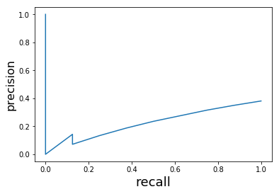


    Class: 1
    Acc: 0.428571428571


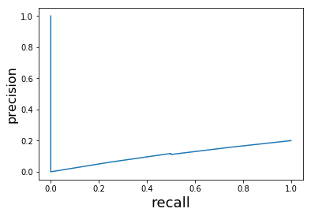


    Class: 2
    Acc: 0.761904761905


    Class: 3
    Acc: 0.857142857143


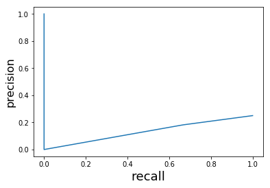


    Class: 4
    Acc: 0.809523809524


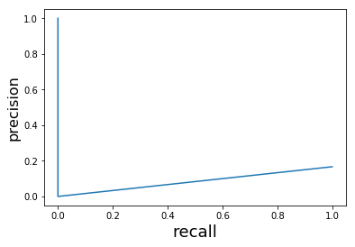


    Class: 5
    Acc: 0.809523809524


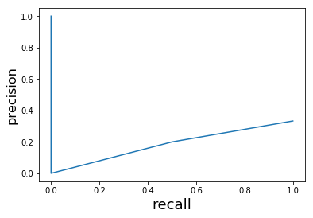


    Class: 6
    Acc: 0.809523809524


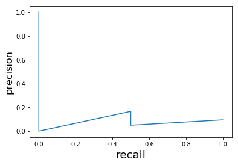


Below is the combined curve of the entire multiclass distribution.


```python
plot_prcurve(classifier, x_test, y_test)
```


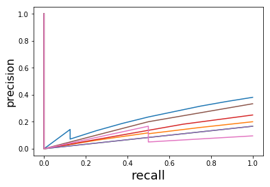


## Neural Network


```python
from sklearn.preprocessing import OneHotEncoder
```


```python
import tensorflow as tf
```


```python
y_train-=1
y_test-=1
```


```python
tf.reset_default_graph()
```


```python
x = tf.placeholder(shape=[None, 16], dtype=tf.float32)
y = tf.placeholder(shape=None, dtype=tf.int32)
```


```python
logits = tf.layers.dense(inputs=x, units=7, activation=None)
loss = tf.nn.softmax_cross_entropy_with_logits(logits=logits, labels=y)
```


```python
output = tf.nn.softmax(logits)
predict = tf.nn.in_top_k(output, y, k=1)
```


```python
optimizer = tf.train.GradientDescentOptimizer(learning_rate=0.01)
training_op = optimizer.minimize(loss)
```


```python
oe = OneHotEncoder(sparse=False)
y_1hot = oe.fit_transform(y_train.reshape(-1,1))
```

    /home/nalin/.virtualenvs/tf/lib/python3.5/site-packages/sklearn/preprocessing/_encoders.py:371: FutureWarning: The handling of integer data will change in version 0.22. Currently, the categories are determined based on the range [0, max(values)], while in the future they will be determined based on the unique values.
    If you want the future behaviour and silence this warning, you can specify "categories='auto'".
    In case you used a LabelEncoder before this OneHotEncoder to convert the categories to integers, then you can now use the OneHotEncoder directly.
      warnings.warn(msg, FutureWarning)


```python
init = tf.global_variables_initializer()
sess = tf.InteractiveSession()
init.run()
for epoch in range(100):
    print("Epoch:", epoch)
    sess.run(training_op, feed_dict={x:x_train, y:y_1hot})
    train_acc = np.mean(sess.run(predict, feed_dict = {x:x_train, y:y_train}))
    test_acc = np.mean(sess.run(predict, feed_dict = {x:x_test, y:y_test}))
    print("Train loss:", train_acc)
    print("Test loss:", test_acc)
```

    Epoch: 0
    Train loss: 0.4125
    Test loss: 0.380952380952
    Epoch: 1
    Train loss: 0.3
    Test loss: 0.333333333333
    Epoch: 2
    Train loss: 0.4125
    Test loss: 0.380952380952
    Epoch: 3
    Train loss: 0.625
    Test loss: 0.571428571429
    Epoch: 4
    Train loss: 0.6875
    Test loss: 0.571428571429
    Epoch: 5
    Train loss: 0.8625
    Test loss: 0.857142857143
    Epoch: 6
    Train loss: 0.85
    Test loss: 0.761904761905
    Epoch: 7
    Train loss: 0.9
    Test loss: 0.857142857143
    Epoch: 8
    Train loss: 0.9
    Test loss: 0.857142857143
    Epoch: 9
    Train loss: 0.9
    Test loss: 0.904761904762
    Epoch: 10
    Train loss: 0.8875
    Test loss: 0.857142857143
    Epoch: 11
    Train loss: 0.9
    Test loss: 0.904761904762
    Epoch: 12
    Train loss: 0.9
    Test loss: 0.904761904762
    Epoch: 13
    Train loss: 0.9125
    Test loss: 0.904761904762
    Epoch: 14
    Train loss: 0.9
    Test loss: 0.904761904762
    Epoch: 15
    Train loss: 0.925
    Test loss: 0.904761904762
    Epoch: 16
    Train loss: 0.925
    Test loss: 0.904761904762
    Epoch: 17
    Train loss: 0.9375
    Test loss: 0.904761904762
    Epoch: 18
    Train loss: 0.9375
    Test loss: 0.904761904762
    Epoch: 19
    Train loss: 0.9375
    Test loss: 0.904761904762
    Epoch: 20
    Train loss: 0.9375
    Test loss: 0.904761904762
    Epoch: 21
    Train loss: 0.95
    Test loss: 0.904761904762
    Epoch: 22
    Train loss: 0.95
    Test loss: 0.904761904762
    Epoch: 23
    Train loss: 0.95
    Test loss: 0.904761904762
    Epoch: 24
    Train loss: 0.95
    Test loss: 0.904761904762
    Epoch: 25
    Train loss: 0.95
    Test loss: 0.904761904762
    Epoch: 26
    Train loss: 0.95
    Test loss: 0.904761904762
    Epoch: 27
    Train loss: 0.95
    Test loss: 0.904761904762
    Epoch: 28
    Train loss: 0.95
    Test loss: 0.904761904762
    Epoch: 29
    Train loss: 0.9625
    Test loss: 0.904761904762
    Epoch: 30
    Train loss: 0.9625
    Test loss: 0.904761904762
    Epoch: 31
    Train loss: 0.9625
    Test loss: 0.904761904762
    Epoch: 32
    Train loss: 0.9625
    Test loss: 0.904761904762
    Epoch: 33
    Train loss: 0.9625
    Test loss: 0.904761904762
    Epoch: 34
    Train loss: 0.9625
    Test loss: 0.904761904762
    Epoch: 35
    Train loss: 0.9625
    Test loss: 0.904761904762
    Epoch: 36
    Train loss: 0.9625
    Test loss: 0.904761904762
    Epoch: 37
    Train loss: 0.9625
    Test loss: 0.904761904762
    Epoch: 38
    Train loss: 0.9625
    Test loss: 0.904761904762
    Epoch: 39
    Train loss: 0.9625
    Test loss: 0.904761904762
    Epoch: 40
    Train loss: 0.9625
    Test loss: 0.904761904762
    Epoch: 41
    Train loss: 0.9625
    Test loss: 0.904761904762
    Epoch: 42
    Train loss: 0.9625
    Test loss: 0.904761904762
    Epoch: 43
    Train loss: 0.9625
    Test loss: 0.904761904762
    Epoch: 44
    Train loss: 0.9625
    Test loss: 0.904761904762
    Epoch: 45
    Train loss: 0.975
    Test loss: 0.904761904762
    Epoch: 46
    Train loss: 0.975
    Test loss: 0.904761904762
    Epoch: 47
    Train loss: 0.975
    Test loss: 0.904761904762
    Epoch: 48
    Train loss: 0.9875
    Test loss: 0.904761904762
    Epoch: 49
    Train loss: 0.9875
    Test loss: 0.904761904762
    Epoch: 50
    Train loss: 0.9875
    Test loss: 0.904761904762
    Epoch: 51
    Train loss: 0.9875
    Test loss: 0.904761904762
    Epoch: 52
    Train loss: 0.9875
    Test loss: 0.904761904762
    Epoch: 53
    Train loss: 0.9875
    Test loss: 0.904761904762
    Epoch: 54
    Train loss: 0.9875
    Test loss: 0.904761904762
    Epoch: 55
    Train loss: 0.9875
    Test loss: 0.904761904762
    Epoch: 56
    Train loss: 0.9875
    Test loss: 0.904761904762
    Epoch: 57
    Train loss: 0.9875
    Test loss: 0.904761904762
    Epoch: 58
    Train loss: 0.9875
    Test loss: 0.904761904762
    Epoch: 59
    Train loss: 0.9875
    Test loss: 0.904761904762
    Epoch: 60
    Train loss: 0.9875
    Test loss: 0.904761904762
    Epoch: 61
    Train loss: 0.9875
    Test loss: 0.904761904762
    Epoch: 62
    Train loss: 0.9875
    Test loss: 0.904761904762
    Epoch: 63
    Train loss: 0.9875
    Test loss: 0.904761904762
    Epoch: 64
    Train loss: 0.9875
    Test loss: 0.904761904762
    Epoch: 65
    Train loss: 0.9875
    Test loss: 0.904761904762
    Epoch: 66
    Train loss: 0.9875
    Test loss: 0.904761904762
    Epoch: 67
    Train loss: 0.9875
    Test loss: 0.904761904762
    Epoch: 68
    Train loss: 0.9875
    Test loss: 0.904761904762
    Epoch: 69
    Train loss: 0.9875
    Test loss: 0.904761904762
    Epoch: 70
    Train loss: 0.9875
    Test loss: 0.904761904762
    Epoch: 71
    Train loss: 0.9875
    Test loss: 0.904761904762
    Epoch: 72
    Train loss: 0.9875
    Test loss: 0.904761904762
    Epoch: 73
    Train loss: 0.9875
    Test loss: 0.904761904762
    Epoch: 74
    Train loss: 0.9875
    Test loss: 0.904761904762
    Epoch: 75
    Train loss: 0.9875
    Test loss: 0.904761904762
    Epoch: 76
    Train loss: 0.9875
    Test loss: 0.904761904762
    Epoch: 77
    Train loss: 0.9875
    Test loss: 0.904761904762
    Epoch: 78
    Train loss: 0.9875
    Test loss: 0.904761904762
    Epoch: 79
    Train loss: 0.9875
    Test loss: 0.904761904762
    Epoch: 80
    Train loss: 0.9875
    Test loss: 0.904761904762
    Epoch: 81
    Train loss: 0.9875
    Test loss: 0.904761904762
    Epoch: 82
    Train loss: 0.9875
    Test loss: 0.904761904762
    Epoch: 83
    Train loss: 0.9875
    Test loss: 0.904761904762
    Epoch: 84
    Train loss: 0.9875
    Test loss: 0.904761904762
    Epoch: 85
    Train loss: 0.9875
    Test loss: 0.904761904762
    Epoch: 86
    Train loss: 0.9875
    Test loss: 0.904761904762
    Epoch: 87
    Train loss: 0.9875
    Test loss: 0.904761904762
    Epoch: 88
    Train loss: 0.9875
    Test loss: 0.904761904762
    Epoch: 89
    Train loss: 0.9875
    Test loss: 0.904761904762
    Epoch: 90
    Train loss: 0.9875
    Test loss: 0.904761904762
    Epoch: 91
    Train loss: 0.9875
    Test loss: 0.904761904762
    Epoch: 92
    Train loss: 0.9875
    Test loss: 0.904761904762
    Epoch: 93
    Train loss: 1.0
    Test loss: 0.952380952381
    Epoch: 94
    Train loss: 1.0
    Test loss: 0.952380952381
    Epoch: 95
    Train loss: 1.0
    Test loss: 0.952380952381
    Epoch: 96
    Train loss: 1.0
    Test loss: 0.952380952381
    Epoch: 97
    Train loss: 1.0
    Test loss: 0.952380952381
    Epoch: 98
    Train loss: 1.0
    Test loss: 0.952380952381
    Epoch: 99
    Train loss: 1.0
    Test loss: 0.952380952381


This function here is just a wrapper to use function "plot_prcurve".


```python
class mymodel:
    def __init__(self,model, sess):
        self.model = model
        self.sess = sess
    
    def predict_proba(self, x_):
        return self.model.eval(feed_dict={x:x_})
```


```python
nn = mymodel(output, sess)
```


```python
plot_prcurve(nn, x_test, y_test, show=2)
```

    Class: 0
    Acc: 0.619047619048


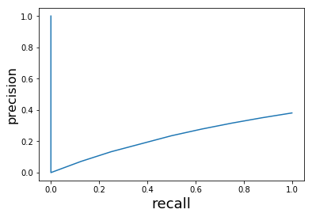


    Class: 1
    Acc: 0.428571428571


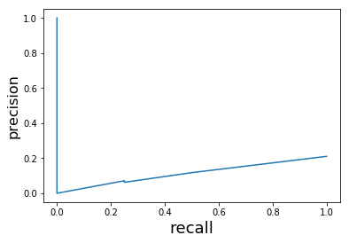


    Class: 2
    Acc: 0.809523809524


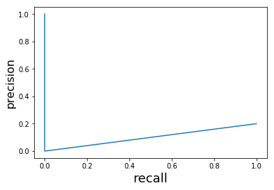


    Class: 3
    Acc: 0.857142857143


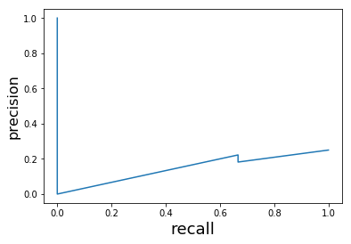


    Class: 4
    Acc: 0.809523809524


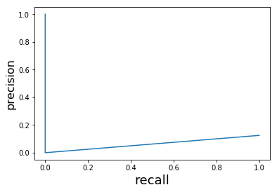


    Class: 5
    Acc: 0.857142857143


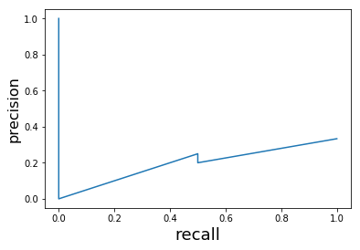


    Class: 6
    Acc: 0.809523809524


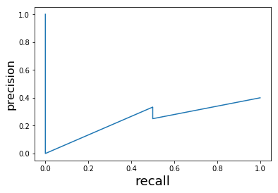


```python
plot_prcurve(nn, x_train, y_train)
```


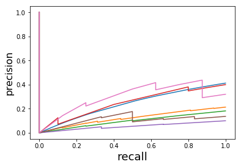


```python
sess.close()
```

### SVM vs NN

Although the training as well as testing accuracy are similar in both the models. It is due to fact that, the SVMs are trained using "ovr" (one vs rest strategy), i.e, the algorithm trains itself by training "no_of_classes"(7 here) binary models and then combining its result for prediction. 
The NN is also trained using the same strategy but, instead of explicitly training 7 binary classifiers, we have used softmax which implicitly does the same as we have not used any hidden layer units.

Under constrained or regularized environment, the SVM might be able to perform well. But considering the fact that the trained NN has high precision and recall than the SVM at corresponding thresholds, we can conclude that, SVMs perform better iff hidden units with non-linear activation is included in the NN model or both will perform similar if NN has no non-linearity/non-linear hidden units.
## SVM

Here we have trained an SVM with **Linear** kernel as per the performance it gave at default settings in comparison to other kernels. 


```python
import numpy as np
from sklearn.metrics import classification_report, precision_recall_curve
from sklearn.svm import SVC
```


```python
x_data = np.load("x.npy")
y_data = np.load("y.npy")
```


```python
from sklearn.model_selection import StratifiedShuffleSplit
```


```python
import matplotlib.pyplot as plt
```


```python
sss = StratifiedShuffleSplit(test_size=0.2)
```


```python
for train_ix, test_ix in sss.split(x_data, y_data):
    x_train, x_test = x_data[train_ix], x_data[test_ix]
    y_train, y_test = y_data[train_ix], y_data[test_ix]
```


```python
x_train.shape, x_test.shape
```


    ((80, 16), (21, 16))


```python
classifier = SVC(kernel="linear", probability=True, C=1)
```


```python
classifier.fit(x_train, y_train)
```


    SVC(C=1, cache_size=200, class_weight=None, coef0=0.0,
      decision_function_shape='ovr', degree=3, gamma='auto_deprecated',
      kernel='linear', max_iter=-1, probability=True, random_state=None,
      shrinking=True, tol=0.001, verbose=False)


```python
def performance(model, x, y):
    return np.mean(y == model.predict(x))
```

Here we have calculated the Testing accuracy of the trained SVM classifier.


```python
performance(classifier, x_test, y_test)
```


    0.95238095238095233


Here we have calculated the Training accuracy of the trained SVM classifier.


```python
performance(classifier, x_train, y_train)
```


    1.0


Its clear here that, the model is overfitted on the data, but, due to less number of instances in the testing dataset the accuracy is around 95%. But since the dataset was shuffled and stratifically splitted, we can consider the model as having a pretty good performance at default settings. To have a better estimate of the performance, lets plot pr-curve.


```python
def plot_prcurve(model, x, y, show=0):
    proba = model.predict_proba(x)
    for class_ in np.unique(y):
        y_class = np.asarray(y == class_, np.int32)
        y_prob = proba[:, class_-1]
        y_pred = np.argmax(proba, axis=1) + 1
        if show>0:
            print("Class:", class_)
            if show>1:
                print("Acc:", np.mean(y_class==(y_pred == class_)))
        precision, recall, thresholds = precision_recall_curve(y_class, y_prob)
        plt.plot(recall, precision)
        plt.xlabel('recall', fontsize=18)
        plt.ylabel('precision', fontsize=16)
        if show>0:
            plt.show()
```

Below we have plotted precision_recall_curve of the SVM classifier.


```python
plot_prcurve(classifier, x_test, y_test, show=2)
```

    Class: 0
    Acc: 0.619047619048


    Class: 1
    Acc: 0.428571428571


    Class: 2
    Acc: 0.761904761905


    Class: 3
    Acc: 0.857142857143


    Class: 4
    Acc: 0.809523809524


    Class: 5
    Acc: 0.809523809524


    Class: 6
    Acc: 0.809523809524


Below is the combined curve of the entire multiclass distribution.


```python
plot_prcurve(classifier, x_test, y_test)
```


## Neural Network


```python
from sklearn.preprocessing import OneHotEncoder
```


```python
import tensorflow as tf
```


```python
y_train-=1
y_test-=1
```


```python
tf.reset_default_graph()
```


```python
x = tf.placeholder(shape=[None, 16], dtype=tf.float32)
y = tf.placeholder(shape=None, dtype=tf.int32)
```


```python
logits = tf.layers.dense(inputs=x, units=7, activation=None)
loss = tf.nn.softmax_cross_entropy_with_logits(logits=logits, labels=y)
```


```python
output = tf.nn.softmax(logits)
predict = tf.nn.in_top_k(output, y, k=1)
```


```python
optimizer = tf.train.GradientDescentOptimizer(learning_rate=0.01)
training_op = optimizer.minimize(loss)
```


```python
oe = OneHotEncoder(sparse=False)
y_1hot = oe.fit_transform(y_train.reshape(-1,1))
```

    /home/nalin/.virtualenvs/tf/lib/python3.5/site-packages/sklearn/preprocessing/_encoders.py:371: FutureWarning: The handling of integer data will change in version 0.22. Currently, the categories are determined based on the range [0, max(values)], while in the future they will be determined based on the unique values.
    If you want the future behaviour and silence this warning, you can specify "categories='auto'".
    In case you used a LabelEncoder before this OneHotEncoder to convert the categories to integers, then you can now use the OneHotEncoder directly.
      warnings.warn(msg, FutureWarning)


```python
init = tf.global_variables_initializer()
sess = tf.InteractiveSession()
init.run()
for epoch in range(100):
    print("Epoch:", epoch)
    sess.run(training_op, feed_dict={x:x_train, y:y_1hot})
    train_acc = np.mean(sess.run(predict, feed_dict = {x:x_train, y:y_train}))
    test_acc = np.mean(sess.run(predict, feed_dict = {x:x_test, y:y_test}))
    print("Train loss:", train_acc)
    print("Test loss:", test_acc)
```

    Epoch: 0
    Train loss: 0.4125
    Test loss: 0.380952380952
    Epoch: 1
    Train loss: 0.3
    Test loss: 0.333333333333
    Epoch: 2
    Train loss: 0.4125
    Test loss: 0.380952380952
    Epoch: 3
    Train loss: 0.625
    Test loss: 0.571428571429
    Epoch: 4
    Train loss: 0.6875
    Test loss: 0.571428571429
    Epoch: 5
    Train loss: 0.8625
    Test loss: 0.857142857143
    Epoch: 6
    Train loss: 0.85
    Test loss: 0.761904761905
    Epoch: 7
    Train loss: 0.9
    Test loss: 0.857142857143
    Epoch: 8
    Train loss: 0.9
    Test loss: 0.857142857143
    Epoch: 9
    Train loss: 0.9
    Test loss: 0.904761904762
    Epoch: 10
    Train loss: 0.8875
    Test loss: 0.857142857143
    Epoch: 11
    Train loss: 0.9
    Test loss: 0.904761904762
    Epoch: 12
    Train loss: 0.9
    Test loss: 0.904761904762
    Epoch: 13
    Train loss: 0.9125
    Test loss: 0.904761904762
    Epoch: 14
    Train loss: 0.9
    Test loss: 0.904761904762
    Epoch: 15
    Train loss: 0.925
    Test loss: 0.904761904762
    Epoch: 16
    Train loss: 0.925
    Test loss: 0.904761904762
    Epoch: 17
    Train loss: 0.9375
    Test loss: 0.904761904762
    Epoch: 18
    Train loss: 0.9375
    Test loss: 0.904761904762
    Epoch: 19
    Train loss: 0.9375
    Test loss: 0.904761904762
    Epoch: 20
    Train loss: 0.9375
    Test loss: 0.904761904762
    Epoch: 21
    Train loss: 0.95
    Test loss: 0.904761904762
    Epoch: 22
    Train loss: 0.95
    Test loss: 0.904761904762
    Epoch: 23
    Train loss: 0.95
    Test loss: 0.904761904762
    Epoch: 24
    Train loss: 0.95
    Test loss: 0.904761904762
    Epoch: 25
    Train loss: 0.95
    Test loss: 0.904761904762
    Epoch: 26
    Train loss: 0.95
    Test loss: 0.904761904762
    Epoch: 27
    Train loss: 0.95
    Test loss: 0.904761904762
    Epoch: 28
    Train loss: 0.95
    Test loss: 0.904761904762
    Epoch: 29
    Train loss: 0.9625
    Test loss: 0.904761904762
    Epoch: 30
    Train loss: 0.9625
    Test loss: 0.904761904762
    Epoch: 31
    Train loss: 0.9625
    Test loss: 0.904761904762
    Epoch: 32
    Train loss: 0.9625
    Test loss: 0.904761904762
    Epoch: 33
    Train loss: 0.9625
    Test loss: 0.904761904762
    Epoch: 34
    Train loss: 0.9625
    Test loss: 0.904761904762
    Epoch: 35
    Train loss: 0.9625
    Test loss: 0.904761904762
    Epoch: 36
    Train loss: 0.9625
    Test loss: 0.904761904762
    Epoch: 37
    Train loss: 0.9625
    Test loss: 0.904761904762
    Epoch: 38
    Train loss: 0.9625
    Test loss: 0.904761904762
    Epoch: 39
    Train loss: 0.9625
    Test loss: 0.904761904762
    Epoch: 40
    Train loss: 0.9625
    Test loss: 0.904761904762
    Epoch: 41
    Train loss: 0.9625
    Test loss: 0.904761904762
    Epoch: 42
    Train loss: 0.9625
    Test loss: 0.904761904762
    Epoch: 43
    Train loss: 0.9625
    Test loss: 0.904761904762
    Epoch: 44
    Train loss: 0.9625
    Test loss: 0.904761904762
    Epoch: 45
    Train loss: 0.975
    Test loss: 0.904761904762
    Epoch: 46
    Train loss: 0.975
    Test loss: 0.904761904762
    Epoch: 47
    Train loss: 0.975
    Test loss: 0.904761904762
    Epoch: 48
    Train loss: 0.9875
    Test loss: 0.904761904762
    Epoch: 49
    Train loss: 0.9875
    Test loss: 0.904761904762
    Epoch: 50
    Train loss: 0.9875
    Test loss: 0.904761904762
    Epoch: 51
    Train loss: 0.9875
    Test loss: 0.904761904762
    Epoch: 52
    Train loss: 0.9875
    Test loss: 0.904761904762
    Epoch: 53
    Train loss: 0.9875
    Test loss: 0.904761904762
    Epoch: 54
    Train loss: 0.9875
    Test loss: 0.904761904762
    Epoch: 55
    Train loss: 0.9875
    Test loss: 0.904761904762
    Epoch: 56
    Train loss: 0.9875
    Test loss: 0.904761904762
    Epoch: 57
    Train loss: 0.9875
    Test loss: 0.904761904762
    Epoch: 58
    Train loss: 0.9875
    Test loss: 0.904761904762
    Epoch: 59
    Train loss: 0.9875
    Test loss: 0.904761904762
    Epoch: 60
    Train loss: 0.9875
    Test loss: 0.904761904762
    Epoch: 61
    Train loss: 0.9875
    Test loss: 0.904761904762
    Epoch: 62
    Train loss: 0.9875
    Test loss: 0.904761904762
    Epoch: 63
    Train loss: 0.9875
    Test loss: 0.904761904762
    Epoch: 64
    Train loss: 0.9875
    Test loss: 0.904761904762
    Epoch: 65
    Train loss: 0.9875
    Test loss: 0.904761904762
    Epoch: 66
    Train loss: 0.9875
    Test loss: 0.904761904762
    Epoch: 67
    Train loss: 0.9875
    Test loss: 0.904761904762
    Epoch: 68
    Train loss: 0.9875
    Test loss: 0.904761904762
    Epoch: 69
    Train loss: 0.9875
    Test loss: 0.904761904762
    Epoch: 70
    Train loss: 0.9875
    Test loss: 0.904761904762
    Epoch: 71
    Train loss: 0.9875
    Test loss: 0.904761904762
    Epoch: 72
    Train loss: 0.9875
    Test loss: 0.904761904762
    Epoch: 73
    Train loss: 0.9875
    Test loss: 0.904761904762
    Epoch: 74
    Train loss: 0.9875
    Test loss: 0.904761904762
    Epoch: 75
    Train loss: 0.9875
    Test loss: 0.904761904762
    Epoch: 76
    Train loss: 0.9875
    Test loss: 0.904761904762
    Epoch: 77
    Train loss: 0.9875
    Test loss: 0.904761904762
    Epoch: 78
    Train loss: 0.9875
    Test loss: 0.904761904762
    Epoch: 79
    Train loss: 0.9875
    Test loss: 0.904761904762
    Epoch: 80
    Train loss: 0.9875
    Test loss: 0.904761904762
    Epoch: 81
    Train loss: 0.9875
    Test loss: 0.904761904762
    Epoch: 82
    Train loss: 0.9875
    Test loss: 0.904761904762
    Epoch: 83
    Train loss: 0.9875
    Test loss: 0.904761904762
    Epoch: 84
    Train loss: 0.9875
    Test loss: 0.904761904762
    Epoch: 85
    Train loss: 0.9875
    Test loss: 0.904761904762
    Epoch: 86
    Train loss: 0.9875
    Test loss: 0.904761904762
    Epoch: 87
    Train loss: 0.9875
    Test loss: 0.904761904762
    Epoch: 88
    Train loss: 0.9875
    Test loss: 0.904761904762
    Epoch: 89
    Train loss: 0.9875
    Test loss: 0.904761904762
    Epoch: 90
    Train loss: 0.9875
    Test loss: 0.904761904762
    Epoch: 91
    Train loss: 0.9875
    Test loss: 0.904761904762
    Epoch: 92
    Train loss: 0.9875
    Test loss: 0.904761904762
    Epoch: 93
    Train loss: 1.0
    Test loss: 0.952380952381
    Epoch: 94
    Train loss: 1.0
    Test loss: 0.952380952381
    Epoch: 95
    Train loss: 1.0
    Test loss: 0.952380952381
    Epoch: 96
    Train loss: 1.0
    Test loss: 0.952380952381
    Epoch: 97
    Train loss: 1.0
    Test loss: 0.952380952381
    Epoch: 98
    Train loss: 1.0
    Test loss: 0.952380952381
    Epoch: 99
    Train loss: 1.0
    Test loss: 0.952380952381


This function here is just a wrapper to use function "plot_prcurve".


```python
class mymodel:
    def __init__(self,model, sess):
        self.model = model
        self.sess = sess
    
    def predict_proba(self, x_):
        return self.model.eval(feed_dict={x:x_})
```


```python
nn = mymodel(output, sess)
```


```python
plot_prcurve(nn, x_test, y_test, show=2)
```

    Class: 0
    Acc: 0.619047619048


    Class: 1
    Acc: 0.428571428571


    Class: 2
    Acc: 0.809523809524


    Class: 3
    Acc: 0.857142857143


    Class: 4
    Acc: 0.809523809524


    Class: 5
    Acc: 0.857142857143


    Class: 6
    Acc: 0.809523809524


```python
plot_prcurve(nn, x_train, y_train)
```


```python
sess.close()
```

### SVM vs NN

Although the training as well as testing accuracy are similar in both the models. It is due to fact that, the SVMs are trained using "ovr" (one vs rest strategy), i.e, the algorithm trains itself by training "no_of_classes"(7 here) binary models and then combining its result for prediction. 
The NN is also trained using the same strategy but, instead of explicitly training 7 binary classifiers, we have used softmax which implicitly does the same as we have not used any hidden layer units.

Under constrained or regularized environment, the SVM might be able to perform well. But considering the fact that the trained NN has high precision and recall than the SVM at corresponding thresholds, we can conclude that, SVMs perform better iff hidden units with non-linear activation is included in the NN model or both will perform similar if NN has no non-linearity/non-linear hidden units.
